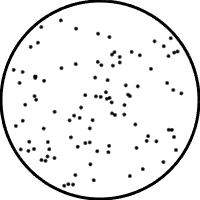
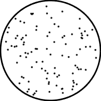
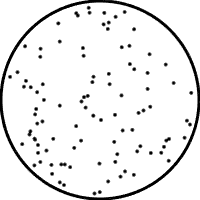
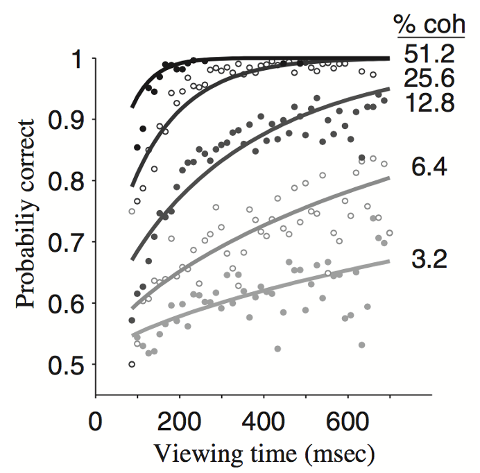

```{r setup, include=FALSE}
knitr::opts_chunk$set(echo = TRUE)
```

## Perceptual Decisions

This lesson is heavily adapted from Robert C Wilson's In this lesson, I am going to introduce you to modeling a single perceptual decision. This lesson assumes you have some familiarity with RStudio's interface as well as variable assignment, basic regular expressions, and data types. It goes over for and if loops.

Perceptual decisions are so ubiquitous most of us don't even think about them as decisions. They refer to decisions based on sensory information we are getting through our eyes, ears, skin, nose, etc. For this tutorial we will focus on visual perceptual decisions. For example, think about seeing someone across the street who you can't quite tell if they are your friend. You spend time watching the person before you make the decision that this is your friend.

For our first model, we are going to consider a relatively "simple" type of perceptual decision based on the logic of the example in the previous paragraph. As simple as this is, and as simple as the simplest models are, decisions like these and the models we use to describe them are a mainstay of mathematical psychology and computational neuroscience and have been applied to everything from memory retrieval to economic decisions.

## Which way are these dots moving?

The particular decision we will focus on involves moving dots, an example is below. This stimulus consists of a bunch of dots that flicker in to and out of existence. When each dot appears it moves in a "semi-random" direction. Most of the time it moves in a preferred direction (in this case to the left), but some of the time it moves in a non-preferred direction (in this case to the right).



The job of the participant is to look at this stimulus and report the preferred direction that most of the dots are moving in. For this simple stimulus, the decision is fairly easy. But the beauty of these stimuli is that we can control the difficulty by changing the fraction of dots moving in the preferred direction *f*. For example, by setting we can get a really easy decision ..



And by setting *f* = 0.25 we can get a decision that is more difficult.



### **Behavior in the moving-dots task**

Unlike the moving dots above, in the simplest version of the moving-dots task, the stimulus is only presented for a short amount of time - usually less than 1 second. After the stimulus has played, subjects have to make their decision either with a button press or an eye movement. This stimulus duration, or "viewing time," along with the fraction of dots moving in the preferred direction, gives us two variables that we can manipulate experimentally that give us some clues as to how this decision may be made.

When these [experiments are performed](http://citeseerx.ist.psu.edu/viewdoc/download?doi=10.1.1.294.1540&rep=rep1&type=pdf), in this case on monkeys, we see behavior that looks like this ...



In this plot, the data points correspond to the probability of making the correct choice as a function of viewing time and coherence, which is related to the fraction moving in the preferred direction as:

*Coherence = 2f - 1*

As both the viewing time and the coherence increase the monkeys are more accurate in their response.

Note that the solid lines in this plot correspond to the behavior of a computational model of this behavior. While the full version of this model is a bit much for our first class in computational modeling, it's actually quite easy to come up with an approximate version that shares many of the same features ...

## **Our first cognitive model**

Building a computational model of a cognitive process is an art form. It involves imagination and introspection as much as it involves mathematics or coding and there are choices and assumptions we have to make along the way.

### **Where to even begin?**

If you consider the dots decision in detail, as trivial as this decision is, it involves a variety of different processes. To perform the task, we have to see the dots (using the output from our retina) and detect their movement with specialized circuits in the visual system. We then have to process the movement of the dots in some way to transform this pattern of movement into a decision (left or right). Then we must register our decision with a movement, a button press or saccade, which involves a signal from motor cortex to contract specific sets of muscles at specific times.

Of course, all of the above assumes that we understand the task to begin with. For humans performing the task, we have to process the language in the instructions, for monkeys, they have to learn by trial and error.

All the time in the task we were breathing, our hearts were breathing, we were fideting, and our minds were likely wandering (these tasks are usually pretty boring to perform!). Perhaps it sounds silly to consider these things, but all of these things have been shown to change how we process stimuli in some circumstances, why shouldn't it be the case here?

Given this complexity, the obvious question is: Where should we even begin?

My advice is to always start simple, ignore as much as possible and focus on the cognitive computation that lies and the heart of the process in question. Complexity is easier (although not always easy) to add later on once you understand the simple model. And, as we shall see, even the simplest of models can lead to insights that are pretty deep ...

### **A counting model of the moving-dots decision**

Let's start with one of the simplest possible accounts of behavior on the dots tasks in which subjects count the dots.

Specifically, we will assume that they can pay attention to a subset of D dots at a time. Then we will assume that they simply count how many of these dots are moving left or right over the whole movie.

We will then define:

-   N_Left as the number of dots going left

-   N_Right as the number of dots going right

-   if N_Left is greater than N_Right, then choose left

-   if N_Right is greater than N_Left, then choose right

-   if N_Left equals N_Right, then choose randomly (50% choose left, 50% choose right)**Implementing the model in Matlab**

## **Setting things up in RStudio**

First we need to setup our script in RStudio. It's always good to start your script with a clear command. This empties RStudio's memory, which can save you all kinds of trouble later on! **If you run into weird bugs in later assignments, always check your code to see if you are missing the clear command at the start.**

So, after opening a new R file in R Studio, we simply write:

```{r}
# this clears the workspace and the enviornment, note it does not remove packages you may have loaded.
rm(list = ls())
```

Next, we need to define some variables. In particular, we need to know how many dots we are paying attention to on each frame of the movie, D, as well as the number of frames people view the stimulus for, T, and the fraction of dots moving in the preferred direction f.

```{r}
# number of dots participants pay attention to
D <- 100
#viewing time in frames
T <- 1
#fraction of dots moving in preferred direction
f <- 0.6
```

## **Determining the direction of one dot**

Now, we need to think about each dot. Which direction is it moving in? Specifically, is it moving in the preferred (correct) direction or the non-preferred (wrong) direction?

Well, we know that it will be moving in the correct direction with probabiliy *f* and in the wrong direction with probability 1-*f.* So how do we transfer this into code to set the direction of a given dot as being "correct" or "wrong"?

First let's define the direction that any dot is moving as a variable "dot_direction". This variable will be 1 if the dot is moving in the correct direction and 0 if it is moving in the wrong direction.

Next, we need to set the value of dot_direction randomly so that it is 1 with probability *f* and 0 with probability *f*. To do this we are going to use a function in R called rbinom (short for random number from a binomial distribution). If we call this function in RStudio with this line, we will assign the dot direction to be 1 with probability *f*.

```{r}

#first we define our probability, f
f <- 0.6

# then we can see the dot direction of one trial off of f
dot_direction <- rbinom(n=1,size=1, prob = f)

# display the dot_direction based off of one trial
dot_direction
```

The output line underneath the code shows the value that was assigned for this particular run of the code. But if we run it again we could get a different number. On average, if we ran this line of code a million times, we would get 600,000 1s and 400,000 0s because we set *f* = 0.6.

## **Determining the direction of many dots**

So far so good! We have defined some functions and we have modeled one dot. Unfortunately, we would like our model to be able to deal with more than just one dot. In the general case, we want to have *D* dots every frame of the movie. How do we set the direction of all of those dots?

Well we could run the previous code over and over and over and over and write down the outcome each time, but that would be incredibly tedious.

\
Happily, there's a way to automate this kind of repetition in RStudio (and other programming languages) using what's known as a "for loop." The notation of these is a bit funky, but when you use for loops they look like this ...

```{r}
# i is an index of whaterver loop we are currently in. we want this to run 10 times (or iterations) so we set i to run for a sequence from 1 to 10 of whatever is between the brackets.
for (i in 1:10)
{
# note the index on the dot direction in brackets[i], this will allow dot_direction to go from being a single value that would be written over each loop to a vector that will grow each iteration.
dot_direction[i] <- rbinom(n=1,size=1, prob = f)
}
# we can then print out the vector as a result of the loop here.
dot_direction

```

For loops are great because we can easily change how many dots we want, if we want 1000 dots I just need to change the 10 to 1000, like this ...

```{r}

for (i in 1:1000)
{

dot_direction[i] <- rbinom(n=1,size=1, prob = f)
}


dot_direction
```

note: there is a much easier way to do this that doesn't require a for loop in R, but for the progression of these lessons, it is important I introduce looping here. If you are curious look up the documentation for the rbinom function and see if you can do it yourself. You can type ?rbinom into the console itself to see.

More generally, I can make the number of items in the loop be a variable. For us, we assume people track *D* dots every frame and that there are *T* frames, meaning they track dots overall. So we can make a loop that runs like this....

```{r}

#first lets define D and T, we will set them arbitrarily now.
D <- 10
T <- 5

# note the only difference from the previous examples is the change from a number as the sequence to D and T, * denotes multiplication
for (i in 1:D*T)
{

dot_direction[i] <- rbinom(n=1,size=1, prob = f)
}

#this should print out a vector of the length D*T, in this example 50 values long
dot_direction

```

## **Counting the dots**

Now we have to count the dots moving in the preferred and non-preferred directions. Note that this is the same as essentially the same as counting the number of dots going left or right, but it allows us to more easily determine whether the model made the correct answer or not.

To do this we need to have two counting variables, one for counting dots moving in the preferred direction and one for counting dots moving in the nonpreferred direction. Let's call these variables, N_Correct and N_Wrong

```{r}

#At the start of our script we need to set these two variables to zero
N_correct<- 0
N_wrong <- 0
#Everytime we get a dot moving in the correct direction we need to increase N_correct by 1.  We can do this by simply adding the dot_direction to N_correct

dot_direction = rbinom(n=1,size=1, f)

N_correct <- N_correct + dot_direction
#Where this line takes the old value of N_correct on the right hand side, adds the value of dot_direction and then updates the new value of N_correct on the left hand side. Note that for simplicity I've removed the for loop.

#We also need to update N_wrong.  This we can do by adding 1 - dot_direction to N_wrong. 
N_wrong = N_wrong + (1 - dot_direction)

#where (1 - dotdirection) will be 0 if dot_direction is 1 and 1 if dot_direction is 0.  
```

Putting it all together it looks something like this.....

```{r}

# this clears the workspace and the enviornment, note it does not remove packages you may have loaded.
rm(list = ls())

# number of dots participants pay attention to
D <- 100
#viewing time in frames
T <- 1
#fraction of dots moving in preferred direction
f <- 0.6

#At the start of our script we need to set these two variables to zero, it is important this is before and outside the for loop.

N_correct<- 0
N_wrong <- 0

# now for the full for loop
for (i in 1:D*T)
{

# note we are no longer indexing dot_direction with the [i] because we no longer want a long value at the end, we just want the 1 or 0 from each loop so N_Correct and N_Wrong can update each loop.
  
# randomly sample the direction of this dot 
dot_direction <- rbinom(n=1,size=1, prob = f)

# update the counts
N_correct <- N_correct + dot_direction
N_wrong <- N_wrong + (1 - dot_direction)

}

#Display the overally number of correct and wrong once the loop is finished.
N_correct
N_wrong


```

Most of the time this model will count more dots moving in the correct direction than in the incorrect direction. But it is possible, simply by chance, that we will count more dots moving in the wrong direction. Note that they should always sum to *D*\**T*. The final thing to do then is compute whether we made the correct decision or not ...

## **Computing the accuracy of the decision**

The last thing to do is to compute the accuracy of this single decision. Did the model make the correct decision or not on this trial?

To compute this accuracy we need to compare the values of N_correct and N_wrong and do different things depending on which is bigger or whether they are the same. For this we are going to use the keyword **if.**

If allows us to only execute commands if a certain condition is met. So we can use this to only do something if N_correct is bigger than N_wrong ...

```{r}

#if right, notice how it uses a similar syntax to a for loop
if (N_correct > N_wrong) {
  # correct answer
  accuracy <- 1
}

accuracy
```

You can almost read the first line here in English. "If N_correct is greater than N_wrong" then it will execute the next lines up to the "end" statement. Conversely, If N_correct \< N_wrong or if N_correct is equal to N_wrong it won't do anything.

So that tackles the accuracy if we are definitely correct, but what if we are definitely wrong? In that case we want to set accuracy to 0.

```{r}

#if wrong 
if (N_correct < N_wrong) {
  # wrong answer
  accuracy <- 0
}

accuracy
```

If I display the accuracy we will find it's still 1There's no change in output here because the line accuracy = 0 is ignored because N_correct is higher than N_wrong.

Finally, what if N_correct and N_wrong are tied? Well, in that case we choose randomly so we've got a 50-50 chance of being correct. We can get this using rbinom again.

and we just need to execute this when N_correct and N_wrong are equal.

Now, to check whether N_correct and N_wrong are equal....

```{r}

# guess randomly if equal, note that equality in R is shown with a double equals sign
if (N_correct == N_wrong) {
  # update accuracy, with a 50/50 chance
  accuracy <- rbinom(n=1,size=1,prob=0.5)
}

```

## Putting it all together

R code for making a model of a single decision in this perceptual task.

```{r}
# this clears the workspace and the enviornment, note it does not remove packages you may have loaded.
rm(list = ls())

# number of dots participants pay attention to
D <- 100
#viewing time in frames
T <- 1
#fraction of dots moving in preferred direction
f <- 0.6

#At the start of our script we need to set these two variables to zero, it is important this is before and outside the for loop.

N_correct<- 0
N_wrong <- 0

# now for the full for loop
for (i in 1:D*T)
{

# note we are no longer indexing dot_direction with the [i] because we no longer want a long value at the end, we just want the 1 or 0 from each loop so N_Correct and N_Wrong can update each loop.
  
# randomly sample the direction of this dot 
dot_direction <- rbinom(n=1,size=1, prob = f)

# update the counts
N_correct <- N_correct + dot_direction
N_wrong <- N_wrong + (1 - dot_direction)

}

#Display the overally number of correct and wrong once the loop is finished.
N_correct
N_wrong

#if right, notice how it uses a similar syntax to a for loop
if (N_correct > N_wrong) {
  # correct answer
  accuracy <- 1
}

#if wrong 
if (N_correct < N_wrong) {
  # wrong answer
  accuracy <- 0
}

# guess randomly if equal, note that equality in R is shown with a double equals sign
if (N_correct == N_wrong) {
  # update accuracy, with a 50/50 chance
  accuracy <- rbinom(n=1,size=1,prob=0.5)
}

accuracy

#This code will print out the number correct, then the number wrong, then the accuracy.
```

Thank you for following along. Please feel free to play around with the values in these code chunks, see if you can get the model to give you fifty correct and incorrect.
